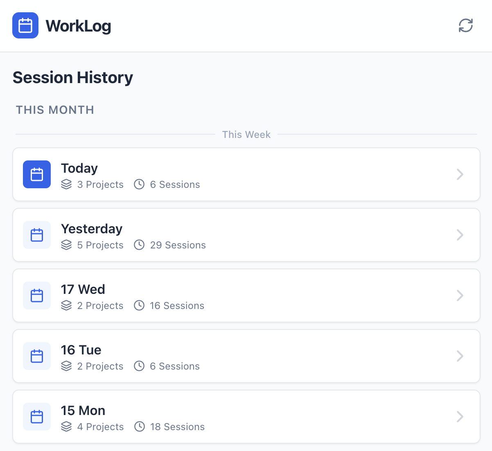
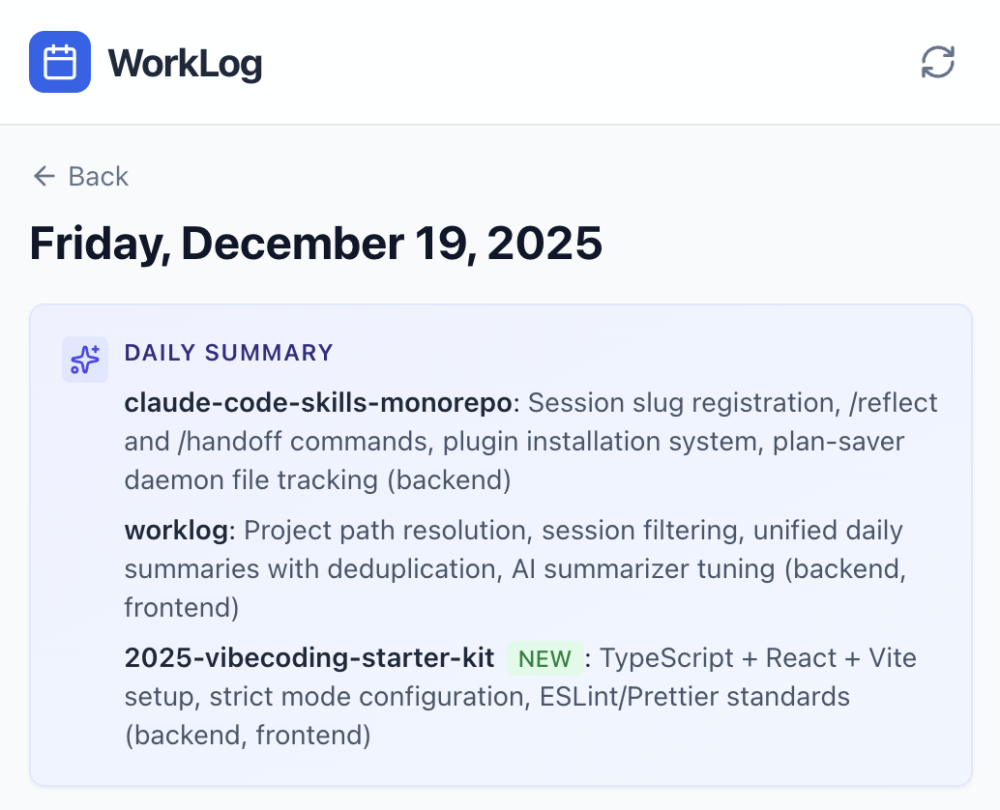

# Worklog

Automatically generates a daily worklog from your Claude Code sessions. See what you actually accomplished, not what you looked at.

<p>
  
  
</p>
<p>
  
</p>

## What it does

- Scans Claude Code session files from `~/.claude/projects/`
- Filters to only sessions where code was actually changed (Write/Edit)
- Summarizes each session using Claude Haiku
- Generates daily summaries grouped by project
- Provides a web UI to browse your work history

## Setup

```bash
# Install dependencies
bun install

# Set your API key
export WORKLOG_API_KEY=sk-ant-...

# Process your sessions
bun cli process

# View the web UI
bun dev
```

Then open http://localhost:5173

## Commands

```bash
bun cli process              # Process new sessions
bun cli process --force      # Reprocess all sessions
bun cli process -d today     # Process today only
bun cli process -w thisweek  # Process this week only
bun cli process -v           # Verbose output (show parsing details)
bun cli status               # Show stats
bun cli serve                # Production server on :3456
bun cli regenerate           # Regenerate daily summaries
bun cli regenerate --force   # Regenerate all daily summaries
```

## Configuration

| Environment Variable | Default | Description |
|---------------------|---------|-------------|
| `WORKLOG_API_KEY` | - | Anthropic API key (required) |
| `WORKLOG_BASE_URL` | - | Custom API base URL (optional) |
| `SUMMARIZER_MODEL` | `claude-haiku-4-5-20251001` | Model for summarization |

## How it works

**Session location**: Looks for Claude Code sessions in `~/.claude/projects/` and `~/.config/claude/projects/`. To use a custom path, set `CLAUDE_CONFIG_DIR` (comma-separated for multiple). See `getClaudePaths()` in `src/core/session-detector.ts`.

**Project path detection**: Claude encodes paths with dashes (`-Users-USERNAME-src-a-myproject`), which is lossy. The tool has special handling for:
- `~/src/a/` - active projects
- `~/src/tries/` - experiments (date prefixes like `2025-12-15-foo` → `foo`)
- `~` - home directory sessions shown as "~"

To customize for your own folder structure, edit `decodeProjectFolder()` in `src/core/session-detector.ts`.

**Session filtering**: Only sessions with actual code changes are included. Reading, searching, and exploring don't count as work.

**Summarization**: Each session is summarized focusing on outcomes - what was built, fixed, or changed. The daily summary rolls up all sessions by project into brief phrases.

**Day boundary**: Days end at 3am, not midnight. Work done before 3am counts toward the previous day (aligns with typical sleep schedules). To change this, edit `getEffectiveDate()` in `src/core/session-reader.ts`.

**Storage**: Processed data is stored in `data/worklog.db` (SQLite).

## Development

```bash
bun dev          # Start Vite dev server + API
bun run build    # Build for production
```

## Tech stack

- Bun runtime
- React + Vite + Tailwind
- SQLite (via bun:sqlite)
- Anthropic AI SDK
